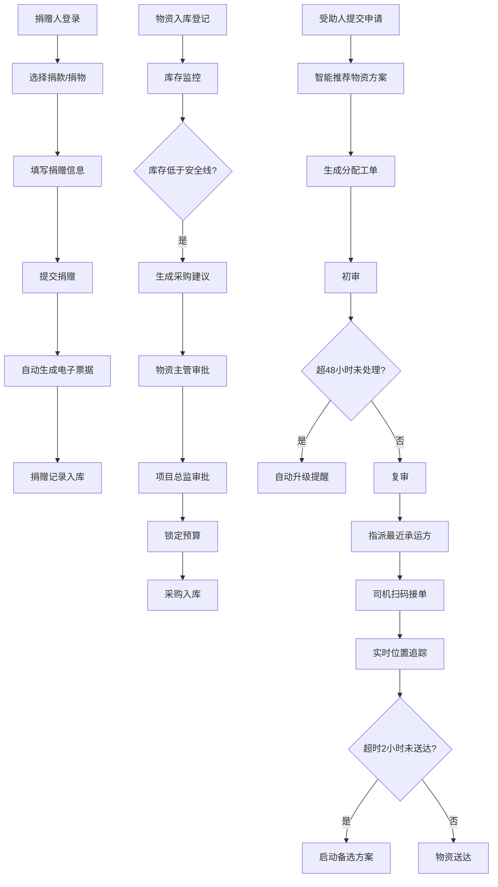

## 1. 产品概述

智慧慈善捐赠与物资管理平台是一个整合捐赠、物资、项目全链路的综合管理系统。平台旨在解决慈善捐赠流程不透明、物资管理效率低下、受助分配不够智能等问题，为基金会、捐赠人、受助人提供一站式数字化解决方案。通过数据可视化大屏实时展示运营情况，智能推荐算法优化物资分配，多级审批机制确保资金安全，实现慈善事业的规范化、透明化、高效化运营。

## 2. 核心功能

### 2.1 用户角色

| 角色 | 注册方式 | 核心权限 |
|------|---------|----------|
| 捐赠人 | 自主注册 | 在线捐款/捐物、查看自己的捐赠记录和电子票据 |
| 项目管理员 | 后台创建 | 管辖项目、查看项目数据、初审受助申请 |
| 物资管理员 | 后台创建 | 物资入库登记、库存管理、处理采购建议、一级审批 |
| 基金会负责人 | 后台创建 | 全局数据查看、二级审批、调整审批规则、导出报表 |

### 2.2 功能模块

1. **首页大屏**：实时数据指标展示（捐赠总额、物资库存周转率、项目完成情况、受助人满意度）、多维度筛选（项目类型、日期范围）、一键导出（月度运营分析报告、物资分发明细）
2. **捐赠模块**：在线捐款、物资捐赠、电子票据自动开具、捐赠明细记录、捐赠人专属视图
3. **物资模块**：物资入库登记（种类、数量、效期、安全库存）、库存预警、采购建议自动生成、两级审批流程、预算锁定
4. **受助申请模块**：家庭信息录入、需求提交、智能物资方案推荐、分配工单生成、初审+复审两级审核、超时自动升级
5. **物流模块**：承运方智能指派（就近原则）、扫码接单、实时位置追踪、超时2小时自动启动备选方案
6. **项目模块**：专项项目创建（助学、助困等）、筹款进度展示、资金使用曲线
7. **系统设置**：审批规则配置、用户管理、权限控制

### 2.3 页面详情

| 页面名称 | 模块名称 | 功能描述 |
|----------|---------|----------|
| 登录页 | 身份认证 | 账号密码登录、角色选择、权限验证 |
| 首页大屏 | 数据可视化 | 4项核心指标卡片、趋势图表、筛选条件面板、导出功能按钮、数据每5秒刷新 |
| 捐赠列表页 | 捐赠管理 | 捐赠记录列表、筛选查询、详情查看、电子票据预览 |
| 捐赠录入页 | 捐赠管理 | 捐款金额输入/捐物信息填写、提交、电子票据即时生成 |
| 物资库存页 | 物资管理 | 库存列表、入库登记、效期预警、安全库存设置 |
| 采购审批页 | 物资管理 | 采购建议列表、物资主管审批、项目总监审批、预算锁定状态 |
| 受助申请页 | 受助管理 | 申请列表、家庭信息录入、需求提交、智能推荐方案 |
| 分配工单页 | 受助管理 | 工单列表、初审、复审、超时提醒、状态跟踪 |
| 物流追踪页 | 物流管理 | 运单列表、位置追踪地图、司机信息、超时预警 |
| 项目管理页 | 项目管理 | 项目列表、创建项目、筹款进度、资金使用曲线 |
| 审批规则页 | 系统设置 | 审批流程配置、阈值设置、规则调整 |
| 用户管理页 | 系统设置 | 用户列表、角色分配、权限管理 |

## 3. 核心流程

### 3.1 捐赠流程
捐赠人登录平台 → 选择捐款或捐物 → 填写捐赠信息（金额/物资种类数量）→ 提交捐赠 → 系统自动生成电子票据 → 捐赠记录存入个人账户 → 捐赠人可随时查看自己的捐赠历史和票据

### 3.2 物资管理流程
物资入库登记（种类、数量、效期、安全库存）→ 系统实时监控库存 → 库存低于安全线自动生成采购建议 → 物资主管一级审批 → 项目总监二级审批 → 审批通过后锁定预算 → 执行采购入库

### 3.3 受助与物流流程
受助人提交申请（家庭信息、需求描述）→ 系统根据紧急程度和库存智能推荐物资方案 → 生成分配工单 → 项目管理员初审 → 基金会负责人复审（超48小时未处理自动升级）→ 审批通过后自动指派最近承运方 → 司机扫码接单 → 实时位置追踪 → 超时2小时未送达自动启动备选方案 → 物资送达完成

### 3.4 流程图表

## 4. 用户界面设计

### 4.1 设计风格

- **主色调**：温暖橙红色系（#E63946）代表慈善爱心，搭配深青色（#1D3557）作为专业稳重的底色
- **辅助色**：绿色（#2A9D8F）表示审批通过/正常状态，黄色（#F4A261）表示预警，红色（#E63946）表示紧急/超时
- **按钮风格**：圆角6px，微立体阴影，hover时有轻微上浮和阴影加深效果
- **字体**：标题使用"Noto Serif SC"衬线字体体现庄重感，正文使用"Noto Sans SC"无衬线字体保证可读性
- **布局风格**：卡片式布局，顶部导航+侧边栏+主内容区的经典管理后台架构
- **图标风格**：使用lucide-react线性图标，保持简洁统一

### 4.2 页面设计概览

| 页面名称 | 模块名称 | UI元素 |
|----------|---------|--------|
| 登录页 | 身份认证 | 居中卡片布局、渐变背景、角色切换标签、表单动效、登录按钮加载动画 |
| 首页大屏 | 数据可视化 | 顶部时间筛选栏、4个大尺寸指标卡片（带数字滚动动画）、趋势折线图、环形进度图、数据表格、导出按钮组 |
| 捐赠录入页 | 捐赠管理 | 步骤指示器、表单分组、金额输入带快捷选项、物资选择器、提交后票据预览弹窗 |
| 物资库存页 | 物资管理 | 库存概览卡片、物资列表表格（带效期颜色标识）、入库表单抽屉、安全库存设置弹窗 |
| 采购审批页 | 物资管理 | 待审批列表、审批流程进度条、审批操作按钮组、预算锁定状态标签 |
| 分配工单页 | 受助管理 | 工单卡片列表、紧急程度标签、审核操作面板、超时提醒倒计时 |
| 物流追踪页 | 物流管理 | 地图组件（模拟）、运单时间线、司机信息卡片、超时预警横幅 |

### 4.3 响应式

采用桌面端优先设计，主内容区最小宽度1200px。侧边栏可折叠，在平板设备上自动折叠。关键数据卡片支持流式布局适配不同屏幕宽度。

### 4.4 动画与交互

- 页面加载：元素从下向上淡入，带0.1s延迟差形成瀑布流效果
- 数字滚动：大屏指标数字从0滚动到目标值，动画时长1.5s
- 卡片hover：轻微上浮3px，阴影加深，过渡时长0.2s
- 抽屉/弹窗：从右侧滑入，背景遮罩淡入
- 数据刷新：每5秒刷新时有轻微的脉冲提示效果
