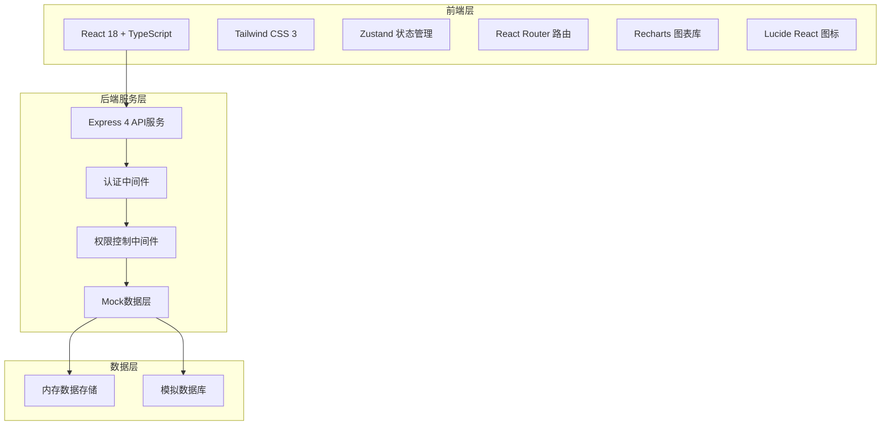
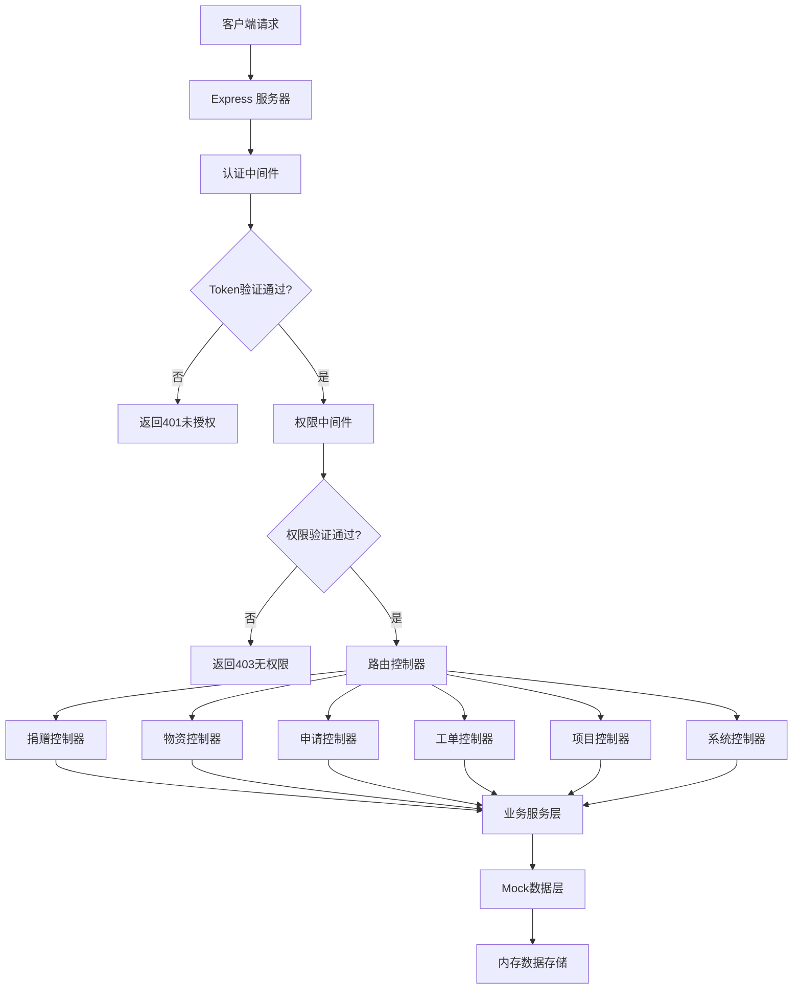
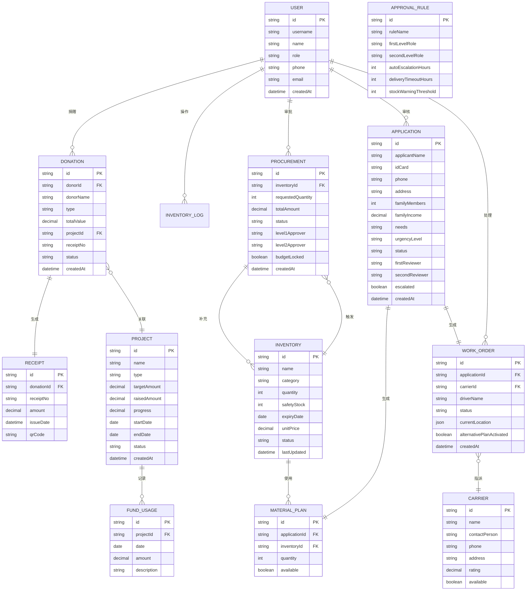

## 1. 架构设计



## 2. 技术描述

- **前端**：React@18 + TypeScript + Vite + Tailwind CSS@3 + Zustand + React Router DOM + Recharts + Lucide React
- **初始化工具**：vite-init
- **后端**：Express@4 + TypeScript（ESM格式）
- **数据层**：内存存储 + Mock数据（无需真实数据库，满足演示需求）
- **图表库**：Recharts（React生态轻量级图表库）

## 3. 路由定义

| 路由路径 | 页面名称 | 权限角色 |
|----------|---------|----------|
| /login | 登录页 | 公开 |
| /dashboard | 首页大屏 | 项目管理员、物资管理员、基金会负责人 |
| /donations | 捐赠列表 | 全部（捐赠人仅看自己） |
| /donations/new | 捐赠录入 | 捐赠人 |
| /inventory | 物资库存 | 物资管理员、基金会负责人 |
| /procurement | 采购审批 | 物资管理员、基金会负责人 |
| /applications | 受助申请 | 项目管理员、基金会负责人 |
| /applications/new | 新建申请 | 项目管理员、基金会负责人 |
| /workorders | 分配工单 | 项目管理员、基金会负责人 |
| /logistics | 物流追踪 | 项目管理员、基金会负责人 |
| /projects | 项目管理 | 项目管理员、基金会负责人 |
| /approval-rules | 审批规则 | 基金会负责人 |
| /users | 用户管理 | 基金会负责人 |

## 4. API 定义

### 4.1 TypeScript 类型定义

```typescript
// 用户类型
type UserRole = 'donor' | 'project_admin' | 'inventory_admin' | 'foundation_admin';

interface User {
  id: string;
  username: string;
  name: string;
  role: UserRole;
  phone?: string;
  email?: string;
  createdAt: string;
}

// 捐赠类型
type DonationType = 'money' | 'goods';
type DonationStatus = 'completed' | 'pending' | 'cancelled';

interface Donation {
  id: string;
  donorId: string;
  donorName: string;
  type: DonationType;
  amount?: number;
  goods?: {
    name: string;
    quantity: number;
    unit: string;
    estimatedValue?: number;
  }[];
  totalValue: number;
  projectId?: string;
  projectName?: string;
  receiptNo: string;
  status: DonationStatus;
  createdAt: string;
}

// 电子票据
interface Receipt {
  id: string;
  donationId: string;
  receiptNo: string;
  donorName: string;
  amount: number;
  items: string;
  issueDate: string;
  qrCode: string;
}

// 物资库存
interface Inventory {
  id: string;
  name: string;
  category: string;
  quantity: number;
  unit: string;
  safetyStock: number;
  expiryDate?: string;
  unitPrice: number;
  totalValue: number;
  lastUpdated: string;
  status: 'normal' | 'warning' | 'expiring' | 'out_of_stock';
}

// 采购建议
type ProcurementStatus = 'pending' | 'approved_level1' | 'approved_level2' | 'rejected' | 'budget_locked' | 'completed';

interface ProcurementRequest {
  id: string;
  inventoryId: string;
  inventoryName: string;
  requestedQuantity: number;
  unit: string;
  estimatedPrice: number;
  totalAmount: number;
  reason: string;
  status: ProcurementStatus;
  level1Approver?: string;
  level1ApprovalTime?: string;
  level1Comment?: string;
  level2Approver?: string;
  level2ApprovalTime?: string;
  level2Comment?: string;
  budgetLocked: boolean;
  createdAt: string;
}

// 受助申请
type UrgencyLevel = 'low' | 'medium' | 'high' | 'critical';
type ApplicationStatus = 'pending' | 'recommended' | 'first_review' | 'second_review' | 'approved' | 'rejected' | 'escalated';

interface AssistanceApplication {
  id: string;
  applicantName: string;
  idCard: string;
  phone: string;
  address: string;
  familyMembers: number;
  familyIncome: number;
  specialSituation?: string;
  needs: string;
  urgencyLevel: UrgencyLevel;
  recommendedPlan?: MaterialPlanItem[];
  status: ApplicationStatus;
  firstReviewer?: string;
  firstReviewTime?: string;
  firstReviewComment?: string;
  secondReviewer?: string;
  secondReviewTime?: string;
  secondReviewComment?: string;
  escalated: boolean;
  createdAt: string;
}

interface MaterialPlanItem {
  inventoryId: string;
  name: string;
  quantity: number;
  unit: string;
  available: boolean;
}

// 分配工单
type WorkOrderStatus = 'pending' | 'assigned' | 'picked_up' | 'in_transit' | 'delivered' | 'alternative' | 'completed';

interface WorkOrder {
  id: string;
  applicationId: string;
  applicantName: string;
  address: string;
  phone: string;
  items: MaterialPlanItem[];
  status: WorkOrderStatus;
  carrierId?: string;
  carrierName?: string;
  driverId?: string;
  driverName?: string;
  driverPhone?: string;
  estimatedDelivery?: string;
  currentLocation?: {
    lat: number;
    lng: number;
    timestamp: string;
  };
  deliveryTime?: string;
  alternativePlanActivated: boolean;
  alternativeReason?: string;
  createdAt: string;
}

// 承运方
interface Carrier {
  id: string;
  name: string;
  contactPerson: string;
  phone: string;
  address: string;
  coverageArea: string;
  rating: number;
  available: boolean;
}

// 项目
interface Project {
  id: string;
  name: string;
  type: 'education' | 'poverty' | 'disaster' | 'medical' | 'other';
  typeName: string;
  description: string;
  targetAmount: number;
  raisedAmount: number;
  progress: number;
  startDate: string;
  endDate: string;
  status: 'active' | 'completed' | 'suspended';
  fundUsage: { date: string; amount: number; description: string }[];
  createdAt: string;
}

// 审批规则
interface ApprovalRule {
  id: string;
  ruleName: string;
  description: string;
  firstLevelApproverRole: string;
  secondLevelApproverRole: string;
  autoEscalationHours: number;
  deliveryTimeoutHours: number;
  stockWarningThreshold: number;
  enabled: boolean;
  updatedAt: string;
}

// 大屏统计数据
interface DashboardStats {
  totalDonations: number;
  totalDonationsYoY: number;
  inventoryTurnover: number;
  inventoryTurnoverYoY: number;
  projectCompletionRate: number;
  projectCompletionRateYoY: number;
  beneficiarySatisfaction: number;
  beneficiarySatisfactionYoY: number;
  donationTrend: { date: string; amount: number }[];
  projectStats: { type: string; completed: number; ongoing: number }[];
  recentDonations: Donation[];
  lowStockItems: Inventory[];
}

// 导出数据
interface ExportRequest {
  type: 'monthly_report' | 'distribution_detail';
  startDate: string;
  endDate: string;
  projectType?: string;
}
```

### 4.2 API 接口列表

| 方法 | 路径 | 描述 |
|------|------|------|
| POST | /api/auth/login | 用户登录 |
| GET | /api/auth/me | 获取当前用户信息 |
| GET | /api/dashboard/stats | 获取大屏统计数据 |
| GET | /api/donations | 获取捐赠列表 |
| GET | /api/donations/:id | 获取捐赠详情 |
| POST | /api/donations | 创建捐赠 |
| GET | /api/donations/:id/receipt | 获取电子票据 |
| GET | /api/inventory | 获取库存列表 |
| POST | /api/inventory | 新增物资入库 |
| PUT | /api/inventory/:id | 更新物资信息 |
| GET | /api/procurement | 获取采购审批列表 |
| POST | /api/procurement/:id/approve-level1 | 一级审批 |
| POST | /api/procurement/:id/approve-level2 | 二级审批 |
| POST | /api/procurement/:id/reject | 拒绝采购 |
| GET | /api/applications | 获取受助申请列表 |
| POST | /api/applications | 创建受助申请 |
| POST | /api/applications/:id/recommend | 生成智能推荐方案 |
| POST | /api/applications/:id/first-review | 初审 |
| POST | /api/applications/:id/second-review | 复审 |
| GET | /api/workorders | 获取工单列表 |
| POST | /api/workorders/:id/assign-carrier | 指派承运方 |
| POST | /api/workorders/:id/accept-order | 司机接单 |
| GET | /api/workorders/:id/tracking | 获取位置追踪 |
| GET | /api/projects | 获取项目列表 |
| POST | /api/projects | 创建项目 |
| GET | /api/projects/:id/fund-usage | 获取资金使用曲线数据 |
| GET | /api/approval-rules | 获取审批规则 |
| PUT | /api/approval-rules/:id | 更新审批规则 |
| GET | /api/users | 获取用户列表 |
| POST | /api/users | 创建用户 |
| PUT | /api/users/:id | 更新用户 |
| POST | /api/export | 导出数据 |

## 5. 服务器架构图



## 6. 数据模型

### 6.1 数据模型ER图



### 6.2 初始化数据脚本

```typescript
// 初始化测试用户
const initialUsers = [
  { id: '1', username: 'donor1', name: '张三（捐赠人）', role: 'donor', phone: '13800138001' },
  { id: '2', username: 'donor2', name: '李四（捐赠人）', role: 'donor', phone: '13800138002' },
  { id: '3', username: 'project_admin', name: '王经理（项目管理员）', role: 'project_admin', phone: '13800138003' },
  { id: '4', username: 'inventory_admin', name: '赵主管（物资管理员）', role: 'inventory_admin', phone: '13800138004' },
  { id: '5', username: 'foundation_admin', name: '刘主任（基金会负责人）', role: 'foundation_admin', phone: '13800138005' },
];

// 默认密码: 123456
```
